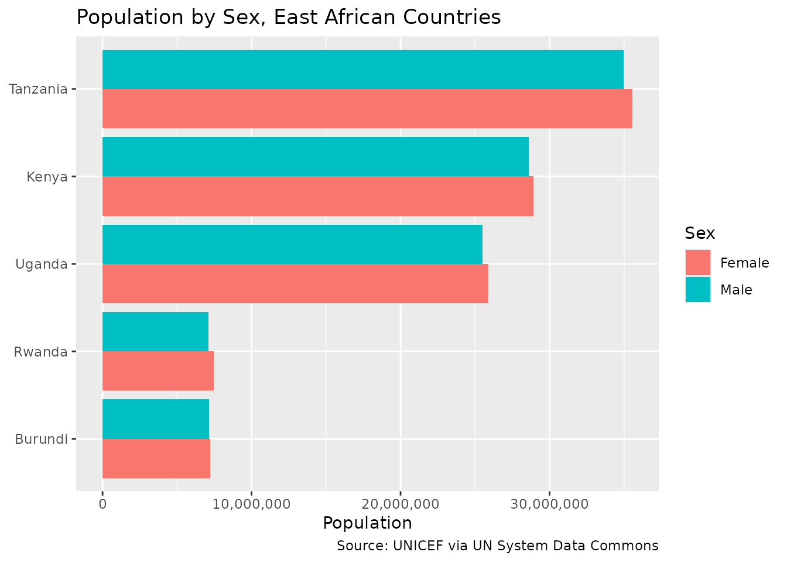

# Using the UN System Data Commons

## Learning Objectives

By the end of this vignette, you will be able to:

- Point the `datacommons` R package at a custom Data Commons deployment
  instead of the public `api.datacommons.org` endpoint
- Query the UN System Data Commons, a deployment maintained by the UN
  Statistics Division on the same Data Commons Core software
- Explore UN-specific statistical variables and place hierarchies
  through
  [`dc_get_node()`](https://tidy-intelligence.github.io/r-datacommons/reference/dc_get_node.md)
- Retrieve and compare observations across countries through
  [`dc_get_observations()`](https://tidy-intelligence.github.io/r-datacommons/reference/dc_get_observations.md)
- Resolve place names to DCIDs through
  [`dc_get_resolve()`](https://tidy-intelligence.github.io/r-datacommons/reference/dc_get_resolve.md)
- Understand which parts of the API are available on this particular
  deployment

## Why a Different Deployment?

Data Commons isn’t a single server: it’s an open-source graph platform
(“Data Commons Core”) that different organizations can deploy with their
own data. The public `api.datacommons.org` endpoint is Google’s
instance, blended from many sources. The [UN System Data
Commons](https://unstats.un.org/UNSDWebsite/undatacommons/) is the UN
Statistics Division’s own deployment of the same software, built from
official UN statistical series (UNICEF, UN Population Division, and
other UN agencies) instead of Google’s blend.

Because both run the same underlying API, the `datacommons` R package
can talk to either one. All you change is the `base_url` (and, for the
UN deployment, you don’t need an API key at all).

## Prerequisites

``` r

library(datacommons)
library(dplyr)
library(stringr)
library(ggplot2)
library(scales)
library(knitr)
```

## Pointing the Package at the UN Deployment

Every function in the package accepts a `base_url` argument, defaulting
to `Sys.getenv("DATACOMMONS_BASE_URL")` with a fallback to the public
endpoint. Instead of passing `base_url` on every call, set it once for
the session with
[`dc_set_base_url()`](https://tidy-intelligence.github.io/r-datacommons/reference/dc_set_base_url.md):

``` r

un_base_url <- "https://unsd-datacommons.gcp.un-icc.cloud/core/api/v2/"
dc_set_base_url(un_base_url)
```

This deployment answers requests without an API key, so there is no
equivalent of
[`dc_set_api_key()`](https://tidy-intelligence.github.io/r-datacommons/reference/dc_set_api_key.md)
to call here. If that ever changes, or if you use a different Data
Commons Core deployment that does require one, pass `api_key` the same
way you would for the public API.

Any call you make for the rest of this session — or until you call
[`dc_set_base_url()`](https://tidy-intelligence.github.io/r-datacommons/reference/dc_set_base_url.md)
again — goes to the UN deployment.

## Example 1: Inspecting the Graph

The UN deployment ships its own [guide to inspecting the graph over
REST](https://projects.officialstatistics.org/undata2/undatacommons-mcp/inspecting-the-graph-with-rest/),
which maps directly onto
[`dc_get_node()`](https://tidy-intelligence.github.io/r-datacommons/reference/dc_get_node.md).
Let’s find out what a country is contained in:

``` r

rwanda_regions <- dc_get_node(
  nodes = "country/RWA",
  expression = "->containedInPlace",
  return_type = "list"
)

rwanda_regions$data$`country/RWA`$arcs$containedInPlace$nodes |>
  lapply(\(x) {
    data.frame(
      name = x$name,
      types = paste(x$types, collapse = ", ")
    )
  }) |>
  bind_rows() |>
  kable(caption = "Places containing Rwanda")
```

| name                                            | types       |
|:------------------------------------------------|:------------|
| Eastern Africa                                  | UNGeoRegion |
| Sub-Saharan Africa                              | UNGeoRegion |
| Africa                                          | Continent   |
| Landlocked developing countries (LLDCs)         | GeoRegion   |
| Landlocked developing countries (LLDCs): Africa | GeoRegion   |
| Least developed countries (LDCs)                | GeoRegion   |
| Least developed countries (LDCs): Africa        | GeoRegion   |

Places containing Rwanda {.table}

UN statistical variables follow their own DCID convention, prefixed by
the contributing agency, e.g. `undata/unicef/DM_POP.SEX--F` for “total
population, female”. You can inspect what a variable belongs to the same
way you would inspect a place:

``` r

dc_get_node(
  nodes = "undata/unicef/DM_POP.SEX--F",
  expression = "->[name, populationType]",
  return_type = "list"
) |>
  str(max.level = 5)
#> List of 1
#>  $ data:List of 1
#>   ..$ undata/unicef/DM_POP.SEX--F:List of 1
#>   .. ..$ arcs:List of 2
#>   .. .. ..$ name          :List of 1
#>   .. .. .. ..$ nodes:List of 1
#>   .. .. ..$ populationType:List of 1
#>   .. .. .. ..$ nodes:List of 1
```

## Example 2: Comparing Population by Sex Across Countries

**Real-world motivation**: UNICEF’s demographic series break population
down by sex, age, and other dimensions. Let’s compare the female and
male population of a group of East African countries.

``` r

east_africa <- c(
  "country/BDI",
  "country/KEN",
  "country/RWA",
  "country/TZA",
  "country/UGA"
)

pop_by_sex <- dc_get_observations(
  date = "latest",
  variable_dcids = c(
    "undata/unicef/DM_POP.SEX--F",
    "undata/unicef/DM_POP.SEX--M"
  ),
  entity_dcids = east_africa,
  return_type = "data.frame"
) |>
  mutate(sex = if_else(str_detect(variable_name, "Female"), "Female", "Male"))

pop_by_sex |>
  select(country = entity_name, sex, value) |>
  arrange(country, sex) |>
  kable(caption = "Latest population by sex, East Africa")
```

| country  | sex    |    value |
|:---------|:-------|---------:|
| Burundi  | Female |  7240984 |
| Burundi  | Male   |  7149018 |
| Kenya    | Female | 28935936 |
| Kenya    | Male   | 28596556 |
| Rwanda   | Female |  7456952 |
| Rwanda   | Male   |  7112388 |
| Tanzania | Female | 35568490 |
| Tanzania | Male   | 34977375 |
| Uganda   | Female | 25889256 |
| Uganda   | Male   | 25495638 |

Latest population by sex, East Africa {.table}

``` r

ggplot(
  pop_by_sex,
  aes(x = reorder(entity_name, value), y = value, fill = sex)
) +
  geom_col(position = "dodge") +
  coord_flip() +
  scale_y_continuous(labels = label_comma()) +
  labs(
    title = "Population by Sex, East African Countries",
    x = NULL,
    y = "Population",
    fill = "Sex",
    caption = "Source: UNICEF via UN System Data Commons"
  )
```



**Key insight**: The same
[`dc_get_observations()`](https://tidy-intelligence.github.io/r-datacommons/reference/dc_get_observations.md)
call you’d use against `api.datacommons.org` works unchanged here — only
the underlying variable and place DCIDs differ, because they come from a
different data source.

## Example 3: Resolving Place Names

Just like the public API, the UN deployment supports resolving
human-readable names to DCIDs:

``` r

dc_get_resolve(
  nodes = c("Kenya", "Uganda"),
  expression = "<-description->dcid",
  return_type = "list"
) |>
  str()
#> List of 1
#>  $ entities:List of 2
#>   ..$ :List of 2
#>   .. ..$ node      : chr "Kenya"
#>   .. ..$ candidates:List of 1
#>   .. .. ..$ :List of 1
#>   .. .. .. ..$ dcid: chr "country/KEN"
#>   ..$ :List of 2
#>   .. ..$ node      : chr "Uganda"
#>   .. ..$ candidates:List of 1
#>   .. .. ..$ :List of 1
#>   .. .. .. ..$ dcid: chr "country/UGA"
```

## Limitations of This Deployment

Not every endpoint behaves the same across deployments. As of this
writing, the UN deployment’s edge infrastructure rejects `POST` requests
to `/sparql` with an HTTP 403 before they reach the application — `GET`
requests to `/node`, `/observation`, and `/resolve` all work normally.
This means
[`dc_post_sparql()`](https://tidy-intelligence.github.io/r-datacommons/reference/dc_post_sparql.md)
currently won’t work against `un_base_url`, even though it works against
the public API. If you need SPARQL access to UN data, check with the UN
Statistics Division for the current status of that endpoint.

## Tips for Working with Custom Deployments

1.  **`base_url` must end in `/core/api/v2/`**: the package validates
    this for any URL other than the public default, to catch typos
    early.
2.  **Explore before you query**: use
    [`dc_get_node()`](https://tidy-intelligence.github.io/r-datacommons/reference/dc_get_node.md)
    with `<-typeOf`, `->containedInPlace`, or `<-member` to discover
    variable and place DCIDs specific to the deployment, the same way
    you’d use the Statistical Variable Explorer for the public API.
3.  **Switch back when you’re done**:
    `dc_set_base_url("https://api.datacommons.org/v2/")` restores the
    default for the rest of your session.
4.  **Not all endpoints are guaranteed**: a deployment can expose a
    subset of the API, or apply different infrastructure-level
    restrictions (as with SPARQL above). Test the specific endpoint you
    need.

## Resources

- **UN System Data Commons**:
  <https://unstats.un.org/UNSDWebsite/undatacommons/>
- **Inspecting the Graph with REST**:
  <https://projects.officialstatistics.org/undata2/undatacommons-mcp/inspecting-the-graph-with-rest/>
- **Data Commons API Documentation**:
  <https://docs.datacommons.org/api/rest/v2/>
